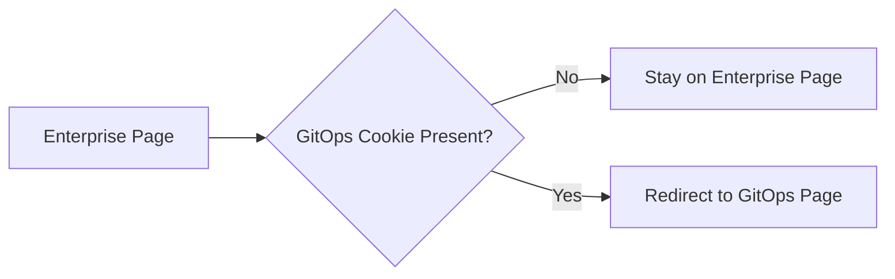
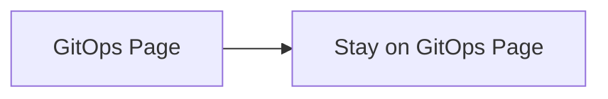

# docs.codefresh.io

This site is built with Jekyll. Documentation content is written in Markdown format located in './docs'

## Deploying

The site is automatically deployed when commits are merged/pushed in `master`, hosted at https://codefresh.io/docs/

### Preview documentation locally with Docker (Recommended)

1. Install [docker-desktop](https://www.docker.com/products/docker-desktop/)
2. Run `docker compose up`
3. Open `http://localhost:3131` in your browser, and voila!

To compile scss files into css run the command `npm run css` or in the live mode `npm run watch-css`.
To compile js files into a bundle run the command `npm run js` or in the live mode `npm run watch-js`.
Node version `9.11.2`

### Preview documentation locally (Legacy method)

1. Install Ruby, `bundler`, `jekyll` and other Ruby dependencies with `bundle install`.
2. Run `npm install` to install Node.js dependencies.
3. Run `npm run css` (or a specific npm script) to rebuild distributed CSS and JavaScript files, as well as our docs assets.
4. From the root directory, run `npm run docs-serve-dev` in the command line.
5. Open `http://localhost:19002` in your browser, and voila.

## Adding document to ArgoHub collection

1. In the Enterprise collection, find the document for the ArgoHub collection.
2. In the ArgoHub collection, create a folder structure for the required document.
3. Create a symbolic link to the document inside the required folder in the ArgoHub collection (refer to the "Create a Symlink" section for details).
4. Create a record for the side menu `argohub-nav.yml` that represents the new document.
   > **Warning:** After adding a new side menu, it is required to delete the `_site` folder to apply the change.
5. Adjust the document and add conditions for Enterprise and ArgoHub contexts if needed.
6. Adjust the the document links (refter to the "Document Links" section).
7. After syncing the documentation content in the CommandBar's Enterprise account, please unpublish the new GitOps Cloud document from the Enterprise content table.
   > **Recommendation:** To exclude all GitOps Cloud pages from the Enterprise segment, search for the keyword `/docs/gitops/`, select all entries, and unpublish them.

## Document Changes

### Content Changes

No actions required - the new content will be automatically reflected in both ArgoHub and Enterprise.

### Path Changes

#### If no changes to the ArgoHub structure are required

- Repeat step 3.
- Repeat step 6.
- Repeat step 7.

#### If changes to the ArgoHub structure are required

- Repeat steps 2 to 7.

### Splitting a Document into Multiple Documents

- Repeat steps 2 to 7.

## ArgoHub Collection Notes

### Switching Between GitOps (ArgoHub) and Enterprise Segments

By default, users are redirected from the Enterprise segment to the GitOps (ArgoHub) segment.

#### Example:

- Accessing https://codefresh.io/docs/ will redirect to https://codefresh.io/docs/gitops/

For more details, refer to the "Auto Redirect from Enterprise to ArgoHub Collection" section below.

#### Switching Between Segments

- Use the segment dropdown menu in the page header to select a segment.
- Use a cookie to automatically switch segments (production only):

  - **To switch to the GitOps segment:** Log in to Codefresh and switch to an account with the GitOps type. This will set the GitOps cookie.
  - **To switch to the Enterprise segment:** Log in to Codefresh and switch to an account with any other type. This will clear the GitOps cookie.

### Reusing Existing Documents

#### Create a Symlink between Enterprise and ArgoHub Collections

1. In the IDE's file explorer, copy the relative path of the file you want to share.
2. Open the terminal and navigate to the directory where you want to create the symlink.
3. Run the following command: `npm run link <relative-path-from-step-1>`

Note: In addition to creating a symlink, the command will also add a record in `argohub-redirect-mapping.json` to ensure auto-redirection functionality.

#### Conditions to Render Text for Specific Contexts

- By default, all document content appears the same in both Enterprise and ArgoHub contexts.
- To include content for the ArgoHub collection only: ``
- To exclude content from the ArgoHub collection (will appear only in the Enterprise collection): ``

#### Document Links

We can rely on the automatic redirect from the Enterprise to the ArgoHub Collection (details provided in the section below) to maintain the collection context. For instance, if a link in an ArgoHub Collection document directs to the Enterprise collection, the auto-redirect will return the user to the ArgoHub Collection.

Additionally, we can use the following methods to avoid redirects if needed:

Document links will automatically adjust to the relevant context, eliminating the need for duplication. For example:
`({{site.baseurl}}/{{page.collection}}/installation/gitops/shared-configuration/)`

Please note that the `{{page.collection}}` argument will only work if the folder structure in ArgoHub and Enterprise collections is the same.
If the paths differ, use an `if` condition to create two separate links.

#### Document Images

Image links do not require duplication or modification – they will work seamlessly in both contexts.

### Search Engines and Internal Search

The ArgoHub home page and all pages within the ArgoHub collection are excluded from:

- Commandbar HelpHub Search (managed via Commandbar Content Manager).
- Search engines that support the `noindex` rule, such as Google.

### Auto-Redirect: Enterprise to ArgoHub Collection

The documentation site automatically redirects users from any Enterprise page to the corresponding GitOps (ArgoHub) page when the GitOps cookie is present.

#### Redirect Logic

#### Redirect Mapping

Redirect links between the Enterprise and ArgoHub collections are stored in the `argohub-redirect-mapping.json` file. Running `npm run link` automatically updates the file, eliminating the need for manual updates.
