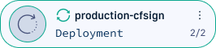
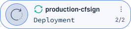
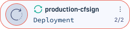

## Monitor individual applications
The GitOps Apps dashboard provides a centralized view of all Argo CD applications in your enterprise, offering detailed insights into deployments, resources, and services across all clusters.


{% include
image.html
lightbox="true"
file="/images/applications/app-dashboard-main-view.png"
url="/images/applications/app-dashboard-main-view.png"
alt="GitOps Apps dashboard: List view"
caption="GitOps Apps dashboard: List view"
max-width="70%"
%}


##### Viewing and filtering applications
By default, the GitOps Apps dashboard displays all applications deployed within the last 30 days. Use filters to refine the view based on deployment history, health status, cluster, namespace, or other attributes.

Applications with [warnings and errors](#identify-argo-cd-applications-with-warningserrors) are flagged, allowing you to quickly identify issues that may require attention.. 

##### Drill down into individual applications
Select any application from the dashboard for a detailed view of its key aspects, including deployment history, resource utilization, and service health.

* **Application Header**  
  Gain quick insights into the application's health, sync status, and available actions for further analysis.  
  See [Application Header](#application-header).

* **Deployment history**  
  Track past deployments, review changes, and analyze deployment trends over time.  
  See [Monitor deployments for selected Argo CD application](#monitoring-application-deployments).
* **Resource states**  
  Explore the application's resources, including associated services and components.  
  See [Monitor resources for selected Argo CD application](#monitoring-application-resources).

* **Service status**  
  Monitor active services and troubleshoot issues as needed.  
  See [Monitor services for selected Argo CD application](#monitoring-application-services).


## Identify Argo CD applications with warnings/errors 
Select any application from the dashboard for a detailed view of its key aspects, including deployment history, resource utilization, and service health.

### Warning: Missing Rollouts reporter in cluster

**Reason**: Codefresh has detected that Argo Rollouts is not installed on the target cluster. Rollout instructions are therefore not executed and the application is not deployed.  
Applications with `rollout` resources need Argo Rollouts on the target cluster, both to visualize rollouts in the GitOps Apps dashboard and control rollout steps with the Rollout Player.  

**Corrective Action**: Click **Install** and install Argo Rollouts on the target cluster.


### Warning: Long sync 
**Reason**: Ongoing sync for application exceeds the [configured timeout]({{site.baseurl}}/docs/deployments/gitops/manage-application/#configure-sync-timeout-for-argo-cd-applications).  
The Codefresh default is Argo CD's default duration of 30 minutes for a sync operation.

  {% include 
   image.html 
   lightbox="true" 
   file="/images/applications/app-sync-timeout-warning.png" 
   url="/images/applications/app-sync-timeout-warning.png" 
   alt="Example of sync timeout exceeded warning in **Warnings/Errors** panel" 
   caption="Example of sync timeout exceeded warning in **Warnings/Errors** panel"
   max-width="60%" 
   %} 

**Corrective Action**: 
1. Click **View Details** to take you directly to the Sync Result tab. 
  Here you can see details on the sync job that was started, and info on the Hooks if any. Failed hooks are displayed at the top. 
1. To see more details such as the message and sync duration, switch to **Sync Info**.
1. Drill down into the application to investigate the issue and make changes.

## Application Header

When you select an application in the GitOps Apps dashboard, the Application Header provides a summary of key details about the current release. It includes information such as the application’s health and sync status, ensuring you can monitor and manage deployments effectively.

{% include
image.html
lightbox="true"
file="/images/applications/application-header.png"
url="/images/applications/application-header.png"
alt="Application Header for selected application"
caption="Application Header for selected application"
max-width="80%"
%}

The Application Header remains visible at the top of the page, regardless of the tab you're navigating within the dashboard. This allows you to quickly access critical information without switching views.

### Key insights in the Application Header
Here are important details and actions in the Application Header:

* **App Health**: The health status of the current release.
* **Current Sync** and **Last Sync Result**: The sync status of the release, and result of the most recent sync operation including the SHA. The sync revision should match the release revision in the deployment record of the Current Release from the last sync operation in the Timeline tab.
* **Product**: Product to which the application belongs, with the list of other applications in the same product categorized by environment.
* **Auto-sync**: Indicates whether auto-sync is enabled or disabled. This information is useful application rollback. If auto-sync is `ON`, the default behavior for GitOps is to sync the cluster with the desired state in Git, and the Rollback button is disabled.


### Analyze out-of-sync applications in Diff View
Identify discrepancies between the desired and live states for out-of-sync applications using Diff View. The Diff View provides a visual representation of discrepancies to help troubleshoot issues more effectively.

Available in the context menu when you select an application, the Diff View presents Inline and Split views, in either full or summary modes.


1. In the Codefresh UI, from the sidebar, select **GitOps Apps**.
1. Filter by **Status** for **Out of sync** applications, and select the application you need.
1. From the context menu on the upper-right, select **Diff View**.  
  The default Diff View highlights the differences in Inline and Compact view modes.

{% include
image.html
lightbox="true"
file="/images/applications/diff-view/app-diff-view.png"
url="/images/applications/diff-view/app-diff-view.png"
alt="Diff View of application in Inline and Compact view modes"
caption="Diff View of application in Inline and Compact view modes"
max-width="50%"
%} 

{:start="4"}
1. For side-by-side comparison and a detailed view, switch to **Split** view, and clear **Compact diff**. 

### View deployment and configuration summary for selected Argo CD application

View deployment, definition, and event information for the selected application in a centralized location through the Quick View.  
A read-only view, the Quick View displays information on the application state and location, labels and annotations, parameters, sync options, manifest, status and sync events.
Access the Quick View from the GitOps Apps dashboard, either from the application's context menu, or after drill down, from the Current State tab.

1. In the Codefresh UI, from the sidebar, select **GitOps Apps**.
1. Do one of the following:  
  * From the List or Card views, select the context menu and then select **Quick View**.
  
{% include
image.html
lightbox="true"
file="/images/applications/quick-view-context-menu.png"
url="/images/applications/quick-view-context-menu.png"
alt="Quick View option in application's context menu"
caption="Quick View option in application's context menu"
max-width="80%"
%} 

  * Select the application, and from the Application Header's context menu on the right, select **Details**.

 {% include
image.html
lightbox="true"
file="/images/applications/app-header-view-details.png"
url="/images/applications/app-header-view-details.png"
alt="View app details from the Application Header context menu"
caption="View app details from the Application Header context menu"
max-width="80%"
%}

  * Select the application, and in the Current State tab, click the parent application resource.

{% include
image.html
lightbox="true"
file="/images/applications/quick-view-access-app-resource.png"
url="/images/applications/quick-view-access-app-resource.png"
alt="Accessing Quick View from the Current State tab"
caption="Accessing Quick View from the Current State tab"
max-width="60%"
%} 

The Quick View includes the following tabs:  
* Summary: Displays health, sync status, and source and destination definitions.
* Metadata: Displays labels and annotations for the application.
* Parameters: Displays parameters configured for the application, based on the tool used to create the application's manifests.   
  The parameters displayed differ according to the tool: `directory`, `Helm` charts, or `Kustomize` manifests, or the specific plugin.  
* Sync Options: Displays the sync options enabled for the application.
* Manifest: Displays the YAML version of the application manifest.
* Events: Displays status and sync events for the application.


## Monitoring application resources


Monitor the live state of resources deployed in the current release of a selected application in the Current State tab.  
When you select an application from the GitOps Apps dashboard, the Current State tab is displayed by default, showing a real-time view of the application’s resources.


{% include
image.html
lightbox="true"
file="/images/applications/app-resources-monitor-screen.png"
url="/images/applications/app-resources-monitor-screen.png"
alt="Monitor application resources in Current State tab"
caption="Monitor application resources in Current State tab"
max-width="60%"
%}

This tab provides key insights into Kubernetes resources, including:
* Health and sync status
* Resource manifests
* Logs and events

The icon for each resource node identifies its Kubernetes resource type. Learn more on K8s resources in [Working with Kubernetes objects](https://kubernetes.io/docs/concepts/overview/working-with-objects/){:target="\_blank"}. 

What can you do with application resources?
* View application resources in [List or Tree views](#tree-and-list-view-modes-for-application-resources)
* [Filter resources](#filters-for-application-resources) to focus on what's important
* [Access external links](#tree-view-access-external-links) if defined
* [Delete resources](#delete-application-resources)
* Monitor resources:
  * [Health status](#health-status-for-application-resources)
  * [Sync status](#sync-status-for-application-resources)
  * [Manifests, logs, and events](#manifests-logs-and-events-for-application-resources)


### Tree and List view modes for application resources

The Current State tab supports Tree and List view formats. 

* Tree view (default): A hierarchical, interactive visualization of resources, ideal for complex deployments.  
  Example:


{% include
image.html
lightbox="true"
file="/images/applications/current-state-tree-app-in-progress.png"
url="/images/applications/current-state-tree-app-in-progress.png"
alt="Tree view of application resources in Current State"
caption="Tree view of application resources in Current State"
max-width="50%"
%}
The Tree view is designed to impart key information at a glance. Review the sections that follow for pointers to quickly get to what you need in the Tree view.  


##### Context menu 
Each resource node has a context menu (three dots icon) with options specific to the resource type.  
For example, resources with configured deep links display additional options for quick access. To configure deep links, see [(Hybrid GitOps) Configure Deep Links to applications & resources]({{site.baseurl}}/docs/installation/gitops/manage-runtimes/#hybrid-gitops-configure-deep-links-to-applications--resources). 

{% include
image.html
lightbox="true"
file="/images/applications/current-state-deep-links-context-menu.png"
url="/images/applications/current-state-deep-links-context-menu.png"
alt="Current State Tree view: Example of context menu with deep link"
caption="Current State Tree view: Example of context menu with deep link"
max-width="50%"
%}

##### Tooltips for quick info  
Mouse over a node to see a tooltip with basic info. 

{% include
image.html
lightbox="true"
file="/images/applications/current-state-resource-summary.png"
url="/images/applications/current-state-resource-summary.png"
alt="Current State Tree view: Resource tooltip"
caption="Current State Tree view: Resource tooltip"
max-width="50%"
%}

##### Resource inventory 
The Resource inventory in the bottom-left summarizes the aggregated count by resource type.  
* The number of `out-of-sync` items for that resource type if any are numbered in red.  
* Selecting any resource type filters the Current State by that resource type and sync status.
  These filters are automatically applied to the default filter list for both Tree and List views. 

Here's an example of an application with out-of-sync resources, and the result on selecting an out-of-sync resource type.


{% include
image.html
lightbox="true"
file="/images/applications/current-state-tree-resource-filtered.png"
url="/images/applications/current-state-tree-resource-filtered.png"
alt="Current State Tree view: Resource inventory filtered by Secrets"
caption="Current State Tree view: Resource inventory filtered by Secrets"
max-width="50%"
%}

* List View: A simplified view of resources, sorted by the Last Update.  
  Example:

{% include
image.html
lightbox="true"
file="/images/applications/apps-current-state.png"
url="/images/applications/apps-current-state.png"
alt="List view of application resources in Current State"
caption="List view of application resources in Current State"
max-width="50%"
%}

### Filters for application resources
Filters apply to both Tree and List views, and persist when switching between views. 

##### `IgnoreExtraneous` filter
Use the `IgnoreExtraneous` filter to hide generated resources such as `ConfigMap` and `pods`, that do not affect the sync status of the application in the Current State view.

 The application remains in-sync even when such resources are syncing or out-of-sync.  
[Argo CD](https://argo-cd.readthedocs.io/en/stable/user-guide/compare-options){:target="\_blank"}
>**NOTE**  
The `IgnoreExtraneous` filter when applied only affects sync status.  
Degraded resources impact the health status of the application.

##### Add `IgnoreExtraneous` annotation

* Add `IgnoreExtraneous` as an annotation to the resource, as in the example below of the `ConfigMap` resource. 

{% include
image.html
lightbox="true"
file="/images/applications/current-state-ignore-extraneous-annotation.png"
url="/images/applications/current-state-ignore-extraneous-annotation.png"
alt="Resource with IgnoreExtraneous annotation"
caption="Resource with IgnoreExtraneous annotation"
max-width="50%"
%}

* In the Current State tab, click the `IgnoreExtraneous` filter.  
 You can see that the `IgnoreExtraneous` filter is active and the `ConfigMap` resource is not displayed in the Current State.

{% include
image.html
lightbox="true"
file="/images/applications/current-state-ignore-extraneous-on.png"
url="/images/applications/current-state-ignore-extraneous-on.png"
alt="Current State filtered by IgnoreExtraneous resources"
caption="Current State filtered by IgnoreExtraneous resources"
max-width="50%"
%}


### Health status for application resources
View and monitor health status of the selected application's resources in the Current State tab, in Tree or List views.  
Identify the health of an application resource through the icon, as described in the table (Tree view), or the textual labels at the right of the resource (List view).  

The table describes the possible health statuses for an application resource in the Tree view. 

{: .table .table-bordered .table-hover}
|  Health icon    | Health status | Description  | 
| --------------  | ------------| ------------------|  
| {::nomarkdown}{:/} {:/}      | **Healthy**     | Resource is functioning as required.  | 
| {::nomarkdown}{:/}  % if page.collection == site.gitops_collection %}{:/}    | **Progressing** | Resource is not healthy but can become healthy before the timeout occurs. | 
| {::nomarkdown}{:/}     |  **Suspended**   | Resource is not functioning, and is either suspended or paused. For example, Cron job or a canary rollout.|
|{::nomarkdown}{:/}        | **Missing**     | Resource is not present on the cluster.  |                        
| {::nomarkdown}{:/}      | **Degraded**    | Resource is not healthy, or a timeout occurred before it could reach a healthy status. |
| {::nomarkdown}{:/}      | **Unknown**   | Resource does not have a health status, or the health status is not tracked in Argo CD. For example, `ConfigMaps` resource types.   |


See also [Argo CD's set of health checks](https://argo-cd.readthedocs.io/en/stable/operator-manual/health/){:target="\_blank"}.


### Sync status for application resources

Similar to the health status, the Current State also tracks the sync status of all application resources. The sync status identifies if the live state of the application resource on the cluster is synced with its desired state in Git.   
Identify the sync status through the icon on the left of the resource name (Tree view), or the textual labels at the right of the resource (List view). 

The table describes the possible sync states for an application resource in the Tree view. 

{: .table .table-bordered .table-hover}
| Sync icon      | Sync state   |Description  |  
| -------------- | ----------    | ----------     |  
| {::nomarkdown}{:/} | **Synced**  | The live state of the resource on the cluster is identical to the desired state in Git.|                            
| {::nomarkdown}{:/}| **Syncing**  | The live state of the resource was not identical to the desired state, and is currently being synced. |  
| {::nomarkdown}{:/}| **Out-of-Sync**  | The live state is not identical to the desired state.<br>To sync a resource, select the **Sync** option from the resource's context menu in Tree view.  |  
| No icon | **Unknown**      | The sync status could not be determined.  |  


>**NOTE**  
  The Application Header displays the statuses of the current and previous sync operations. Clicking **More** opens the Sync panels with Sync Info, Sync Result and Commit Info.
  The Application Warnings/Errors panel surfaces sync errors on exceeding the maximum number of retries and when a sync operation extends beyond 30 minutes.


### Search application resources
Quickly find a resource by typing the resource name in the search field. 
{% include
image.html
lightbox="true"
file="/images/applications/current-state-tree-search.png"
url="/images/applications/current-state-tree-search.png"
alt="Current State Tree view: Search resources"
caption="Current State: Search resources"
max-width="50%"
%}


### Delete application resources
Delete specific resources in an application directly from the Codefresh UI. 

1. In the Codefresh UI, from the sidebar, under OPS, select **GitOps Apps**.
1. From the Application dashboard, select the application with the resource to delete.
1. From the context menu of the resource, select **Delete**.

{% include
image.html
lightbox="true"
file="/images/applications/current-state-delete-resource.png"
url="/images/applications/current-state-delete-resource.png"
alt="Current State: Delete an application resource"
caption="Current State: Delete an application resource"
max-width="50%"
%}


### Tree view: Access external links
Resources with annotations for external links, display {::nomarkdown}{:/} below their context menu. Ingress resources automatically display external links. Clicking the icon lists available links.  
For more details on this feature, see [Argo CD's documentation on Adding external URLs](https://argo-cd.readthedocs.io/en/stable/user-guide/external-url/){:target="\_blank"}.

>**NOTE**  
This feature requires GitOps Runtime chart version 0.10.0.

##### Configure external links
Use this annotation to add the external link to a Kubernetes resource:
```yaml
annotations:
  link.argocd.argoproj.io/external-link: http://my-grafana.example.com/pre-generated-link
```

{% include
image.html
lightbox="true"
file="/images/applications/current-state-resource-external-link.png"
url="/images/applications/current-state-resource-external-link.png"
alt="External links for deployment resource in Current State Tree view"
caption="External links for deployment resource in Current State Tree view"
max-width="50%"
%}

 Clicking {::nomarkdown}{:/} displays the links configured. 


### Manifests, logs, and events for application resources

Each application resource provides different types of information in three main tabs: Summary, Logs, and Events. The availability of these tabs depends on the resource type. For example, pods show manifests, logs, and events, while endpoints show only manifests.

##### Summary tab

The Summary tab displays the manifest of the selected resource, showing its Desired and Live states:
* **Desired State**: The state defined in Git (single source of truth). Managed resources, stored in Git repositories and using Git as the single source of truth show both Desired (Git) and the Live (cluster) states.    
* **Live State**: The state currently in the cluster displayed for all resources.
* **Diff View**: Highlights discrepancies between Desired and Live states for managed resources.


Key actions in the Summary tab:
* **Search**: Use Ctrl/Command + F to find strings in the manifest.
* **Share URL**: Copy a link to share resource details with collaborators. Pasting the URL in a browser opens to the same view of the resource.
* **Hide Managed Fields**: Hide Kubernetes-managed fields in the Live state to simplify the view. Hiding managed fields removes field management metadata introduced by Kubernetes `Server Side Apply`. For more information, see [Field Management](https://kubernetes.io/docs/reference/using-api/server-side-apply/#field-management){:target="\_blank"}.


###### Logs tab
Logs are available only for resource types such as pods. If the Logs tab is unavailable, it may indicate a permission issue, and you need to contact your administrator

Key actions in the Logs tab:
* **Search**: Perform free-text search with navigation options (Next/Previous).
* **Wrap lines**: Enable or disable line wrapping for readability.
* **Download**: Save logs to a text file for offline analysis.


##### Events tab
The Events tab displays both successful and failed events from Argo CD, starting with the most recent event. 

Key features of the Events tab:
* **Real-time updates**: Events are listed as they occur, starting with the most recent.
* **Retention period**: Events are kept for 30 minutes. Older events are removed automatically.

>**NOTE**  
If your runtime version does not support event viewing, upgrade to the required version when prompted.


## Monitoring application deployments 

Monitor ongoing and historical deployments for the selected application. 
The Timeline tab displays all the deployments for the selected application, with the Current Release deployment record at the top, followed by the list of Previous Releases.  


{% include
image.html
lightbox="true"
file="/images/applications/dashboard-timeline-main.png"
url="/images/applications/dashboard-timeline-main.png"
alt="GitOps Apps dashboard: Timeline tab"
caption="GitOps Apps dashboard: Timeline tab"
max-width="50%"
%}


**Deployment Chart**  
The Deployment Chart below the Application Header displays the day-to-day deployments for the selected time period.  
To view information on historical deployments, mouse over the dot on the deployment chart.  

**Current Release**
* The Current Release deployment record is only displayed in the first page of deployments. 
* The deployment record for the Current Release is tagged as Current Version. 
* The health status of the Current Release is the application's health status as displayed in the Application Header.
* The release revision is identical to the sync revision displayed in Last Sync Result. If the release and sync revisions are not identical, which can be the case for different reasons, the Current Release displays a loading status instead of the release revision. 

{{site.data.callout.callout_tip}}
**TIP**  
If the Current Release deployment record is not displayed, it could be because filters are applied. 
{{site.data.callout.end}}

{% include image.html
lightbox="true"
file="/images/applications/apps-dashboard-current-release.png"
url="/images/applications/apps-dashboard-current-release.png"
alt="GitOps Apps dashboard: Current Release deployment record in Timeline tab"
caption="GitOps Apps dashboard: Current Release deployment record in Timeline tab"
max-width="50%"
%}


You can:  
* [Monitor CI details by deployments](#monitor-ci-details-by-deployment) 
* [Monitor rollouts by deployment](#monitor-rollouts-by-deployment)  

See also [Troubleshooting Argo CD applications]({{site.baseurl}}/docs/deployments/gitops/troubleshooting-gitops-apps/).

##### How to monitor deployments
1. If required, set filters to narrow the number of deployments for the selected application.
1. To view GitOps details for a deployment, in the deployment chart mouse over the dot that represents the deployment. 
1. To view additional details, expand the record for that deployment.

{% include
image.html
lightbox="true"
file="/images/applications/apps-historical-deployment.png"
url="/images/applications/apps-historical-deployment.png"
alt="GitOps Apps dashboard: Deployment chart"
caption="GitOps Apps dashboard: Deployment chart"
max-width="60%"
%}


### Monitor CI details by deployment

Each deployment record displays the complete CI history for that deployment.
* The **CI Builds** shows the Argo Workflow run in the deployment. Click the build name to see the Argo Workflow in a new browser window.
* The **Pull Request (PRs)** used for the commit.
* The Jira **Issues** the PR aims to resolve or has resolved, with the current status.
* The **Committer** who made the changes.

### Monitor rollouts by deployment
A rollout is initiated when there is an Argo CD sync due to a change in the desired state.  
Visualize ongoing and completed rollouts by deployments in **Updated Services**. 

Clicking the image name displays the image in the **Images** dashboard. 

>**NOTE**  
To view and manage a rollout, you must have an Argo `rollout` resource defined for your application, and [install Argo Rollouts in the cluster]({{site.baseurl}}/docs/deployments/gitops/install-argo-rollouts/).  

For detailed information on Argo Rollouts, see [Argo Rollouts documentation](https://argoproj.github.io/argo-rollouts/){:target="\_blank"}.

#### Rollout progress
For an ongoing rollout, the rollout bar displays the progress of the rollout. You can also visualize the steps in the rollout, and control the rollout using the options in the Rollout Player.  

Here is an example of an ongoing rollout for a canary deployment in Updated Services. The rollout comprising four steps has not started, and no traffic has not been routed as yet to the new version of the application.

{% include
image.html
lightbox="true"
file="/images/applications/apps-dashboard-rollout-in-progress.png"
url="/images/applications/apps-dashboard-rollout-in-progress.png"
alt="Rollout in progress for deployment"
caption="Rollout in progress for deployment"
max-width="50%"
%}

Based on the current state of the rollout, you can pause and resume an ongoing rollout.  
Here is an example of the rollout for the same deployment on completion. All traffic has been routed to the new version. 

{% include
image.html
lightbox="true"
file="/images/applications/apps-dashboard-rollout-complete.png"
url="/images/applications/apps-dashboard-rollout-complete.png"
alt="Rollout completed for deployment"
caption="Rollout completed for deployment"
max-width="50%"
%}

#### Manage ongoing rollout
Click the rollout name to visualize its steps. Manually manage the rollout through the controls in the Rollout Player. 
Here you can see that two out of four steps have been completed, 25% of the traffic has been routed, and the rollout has been paused for the defined length of time.  

{% include
image.html
lightbox="true"
file="/images/applications/rollout-player.png"
url="/images/applications/rollout-player.png"
alt="Rollout step visualization and Rollout Player"
caption="Rollout steps and Rollout Player"
max-width="50%"
%}

 
The table lists the controls in the Rollout Player to manage an ongoing rollout.

{: .table .table-bordered .table-hover}
|Rollback player icon | Option   | Description |  
| --------------  | ------------| 
| {::nomarkdown}  {:/}  | **Rollback**  | Rollback rollout to the selec.  | 
| {::nomarkdown} {:/}    |**Resume**     | Resume a step that has been paused indefinitely. | 
| {::nomarkdown} {:/} | **Skip step** | Skip execution of current step. Such steps are marked as Skipped in the rollout visualization. | 
| {::nomarkdown} {:/}| **Promote full rollout**    | Skip remaining pause, traffic routing, and analysis steps, and deploy the current release. |                        


 
#### View analysis run
If you have defined an AnalysisTemplate for the rollout, you can check the run results and the manifest. 
 The result of an AnalysisRun determines if the rollout is completed, paused, or aborted. For detailed information, see the [Analysis section in Argo Rollouts](https://argoproj.github.io/argo-rollouts/features/analysis/){:target="\_blank"}.  

If you are running Background Analysis for example, the first step shows the list of analysis metrics.

{% include
image.html
lightbox="true"
file="/images/applications/app-rollout-analysis-template-step.png"
url="/images/applications/app-rollout-analysis-template-step.png"
alt="Rollout: Analysis Metrics in Background Analysis"
caption="Analysis Template: Analysis Metrics in Background Analysis"
max-width="50%"
%}

Click the metric link in the step. 

{% include
image.html
lightbox="true"
file="/images/applications/app-rollout-run-results-manifest.png"
url="/images/applications/app-rollout-run-results-manifest.png"
alt="Analysis Template: Run Results and Manifest for Analysis Metric"
caption="Analysis Template: Run Results and Manifest for Analysis Metric"
max-width="50%"
%}


## Monitoring application services


The Services tab shows the K8s services for each deployment of the application. 
Each service shows the number of replicas, the endpoint IP, the labels that reference the application, and the health status.  

For more information, see the official documentation on [Services](https://kubernetes.io/docs/concepts/services-networking/service/){:target="\_blank"}.

{% include
image.html
lightbox="true"
file="/images/applications/apps-dashboard-services.png"
url="/images/applications/apps-dashboard-services.png"
alt="GitOps Apps dashboard: Services tab"
caption="GitOps Apps dashboard: Services tab"
max-width="50%"
%}


## Related articles
[Creating Argo CD applications]({{site.baseurl}}/docs/deployments/gitops/create-application/)  
[Managing Argo CD applications]({{site.baseurl}}/docs/deployments/gitops/manage-application/)  
[Troubleshooting Argo CD applications]({{site.baseurl}}/docs/deployments/gitops/troubleshooting-gitops-apps/)  
[Environments dashboard]({{site.baseurl}}/docs/dashboards/gitops-environments/)    
[Products dashboard]({{site.baseurl}}/docs/dashboards/gitops-products/)  
[DORA metrics]({{site.baseurl}}/docs/dashboards/dora-metrics/)  


